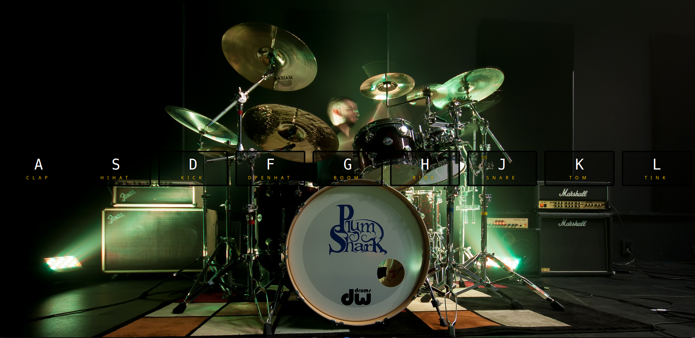

# 🥁 Project Name: JavaScript Drumkit

An interactive audio drum kit built using vanilla JavaScript that maps specific keyboard keys to trigger high-quality drum samples. This project focuses on real-time event listening and seamless DOM manipulation.

---

## 🖼️ Visual Preview

---

## 🚀 Key Features

- **Global Input Capture:** Listens for events globally across the entire user viewport.
- **Dynamic UI Updates:** Instantly applies CSS transitions and scales layout elements seamlessly.

---

## 🤝 Credits & Acknowledgments

- This project is a personal implementation built as part of the **JavaScript 30** challenge created by [Wes Bos](https://wesbos.com/). 
- All audio assets and design inspiration are credited to the original course.

